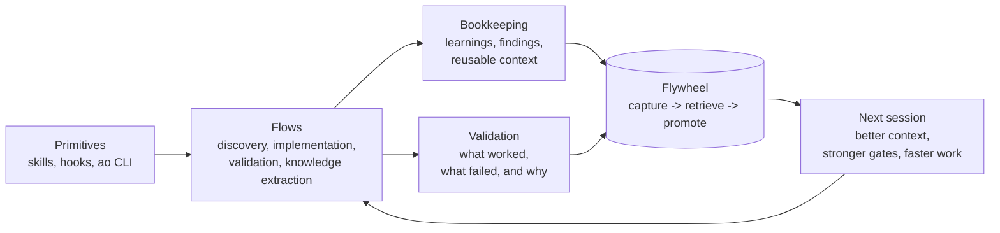

<div align="center">

# AgentOps

[](https://github.com/boshu2/agentops/actions/workflows/validate.yml)
[](https://github.com/boshu2/agentops/actions/workflows/nightly.yml)
[](https://github.com/boshu2/agentops/stargazers)

### Coding agents don't do their own bookkeeping.

The operational layer for coding agents. AgentOps adds bookkeeping, validation, primitives, and flows so every session starts where the last one left off.

[Install](#install) · [See It Work](#see-it-work) · [Start Here](#start-here) · [Behavior](docs/behavioral-discipline.md) · [What You Get](#what-agentops-gives-you) · [Skills](#skills) · [CLI](#the-ao-cli) · [FAQ](#faq) · [Docs](docs/INDEX.md) · [Newcomer Guide](docs/newcomer-guide.md)

</div>

---

## Install

```bash
# Claude Code (recommended): marketplace + plugin install
claude plugin marketplace add boshu2/agentops
claude plugin install agentops@agentops-marketplace

# Codex CLI on macOS/Linux/WSL (v0.115.0+ native hooks by default)
curl -fsSL https://raw.githubusercontent.com/boshu2/agentops/main/scripts/install-codex.sh | bash

# Codex CLI on Windows PowerShell
irm https://raw.githubusercontent.com/boshu2/agentops/main/scripts/install-codex.ps1 | iex

# OpenCode
curl -fsSL https://raw.githubusercontent.com/boshu2/agentops/main/scripts/install-opencode.sh | bash

# Other Skills-compatible agents (example: Cursor)
npx skills@latest add boshu2/agentops --cursor -g
```

Then type `/quickstart` in your agent chat.

For Codex, use the shell installer on macOS/Linux/WSL and the PowerShell installer
on native Windows. The installer stages the native plugin, installs
`~/.codex/hooks.json`, archives stale raw mirrors when found, and makes native hooks the default path.
Restart Codex after install.

| Concern | Answer |
|---------|--------|
| What it touches | Installs skills globally, writes knowledge artifacts to `.agents/`, registers Claude hooks in `.claude/settings.json` when requested, and for Codex writes the native plugin cache plus `~/.codex/hooks.json` |
| Source code changes | None. AgentOps does not modify your source code during install |
| Network behavior | Install and update paths fetch from GitHub. Repo artifacts stay local unless you choose external tools, browsing, or remote model runtimes |
| Permission surface | Skills may run shell commands and read or write repo files as part of agent work, so install it where you want an agent to operate |
| Reversible | Remove the installed skill directories, delete `.agents/`, and remove hook entries from `.claude/settings.json` |

Nothing modifies your source code.

<details>
<summary><b>Install `ao` CLI</b> — optional, unlocks the full repo-native layer</summary>

Skills work standalone. The `ao` CLI adds bookkeeping automation, retrieval and injection, maturity scoring, goals, and terminal-native flows.

```bash
brew tap boshu2/agentops https://github.com/boshu2/homebrew-agentops
brew install agentops
which ao
ao version
```

Or install via [release binaries](https://github.com/boshu2/agentops/releases) or [build from source](cli/README.md).

</details>

<details>
<summary><b>Other install notes</b> — Linux, OpenCode, configuration</summary>

On Linux, install system `bubblewrap` so Codex uses it directly:

```bash
sudo apt-get install -y bubblewrap
```

OpenCode details: [.opencode/INSTALL.md](.opencode/INSTALL.md)

All configuration is optional. Full reference: [docs/ENV-VARS.md](docs/ENV-VARS.md)

</details>

Troubleshooting: [docs/troubleshooting.md](docs/troubleshooting.md)

---

## See It Work

**One command** — validate a PR:

```text
> /council validate this PR

[council] 3 judges spawned (independent, no anchoring)
[judge-1] PASS — token bucket implementation correct
[judge-2] WARN — rate limiting missing on /login endpoint
[judge-3] PASS — Redis integration follows middleware pattern
Consensus: WARN — add rate limiting to /login before shipping
```

**Full pipeline** — research through post-mortem:

```text
> /rpi "add retry backoff to rate limiter"

[research]    Found 3 prior learnings on rate limiting (injected)
[plan]        2 issues, 1 wave → epic ag-0058
[pre-mortem]  Council validates plan → PASS (knew about Redis choice)
[crank]       Parallel agents: Wave 1 ██ 2/2
[vibe]        Council validates code → PASS
[post-mortem] 2 new learnings → .agents/
[flywheel]    Next: /rpi "add circuit breaker to external API calls"
```

**The endgame** — define goals, walk away, come back to a better codebase:

```text
> /evolve

[evolve] GOALS.md: 18 gates loaded, score 77.0% (14/18 passing)

[cycle-1]     Worst: wiring-closure (weight 6) + 3 more
              /rpi "Fix failing goals" → score 93.3% (25/28) ✓

              ── the agent naturally organizes into phases ──

[cycle-2-35]  Coverage blitz: 17 packages from ~85% → ~97% avg
[cycle-38-59] Benchmarks added to all 15 internal packages
[cycle-60-95] Complexity annihilation: zero functions >= 8
[cycle-96-116] Modernization: sentinel errors, exhaustive switches

[teardown]    203 files changed, 20K+ lines, 116 cycles
              All tests pass. Go vet clean. Avg coverage 97%.
              /post-mortem → 33 learnings extracted
```

That ran overnight on this repo. Regression gates auto-reverted anything that broke a passing goal.

**The night-shift endgame** — your agent wakes up smarter, even when you don't touch code:

```text
> /dream start

[overnight]  RunLoop starting (budget=2h, max_iter=4, K=2, warn_only=true)
[iter-1]     INGEST   harvest catalog: 152 artifacts (dry-run preview)
             REDUCE   harvest-promote → dedup → defrag-prune → close-loop
                      findings-router: 7 new → next-work.jsonl
                      inject-refresh: in-process
                      metadata integrity: PASS (0 stripped fields)
             COMMIT   staging → live (per-subpath rename)
             MEASURE  corpus-quality snapshot captured  (4.2s)
[iter-2]     INGEST clean · REDUCE clean · MEASURE Δ +0.003 (plateau)
[halted]     plateau — K=2 consecutive sub-epsilon deltas

Morning report: .agents/overnight/<run-id>/summary.md
  • 2 committed iterations · 0 rolled back
  • 7 findings routed into next-work.jsonl
  • 0 source mutations · 0 git ops · 0 symlinks  (anti-goals enforced)
  • Inject cache rebuilt — /evolve tomorrow starts against a fresher corpus
```

`/evolve` is the day loop — fitness-driven code improvement that can touch source. `/dream` is the night loop — fitness-driven *knowledge* compounding that never touches source, runs through a checkpointed overlay, and rolls back on regression. Run Dream overnight, run Evolve in the morning against the compounded corpus, and the environment gets sharper even when you're asleep.

<details>
<summary><b>More examples</b> — swarm, continuity, and intent-based entry points</summary>

<br>

**Parallelize anything** with `/swarm`:

```text
> /swarm "research auth patterns, brainstorm rate limiting improvements"

[swarm] 3 agents spawned — each gets fresh context
[agent-1] /research auth — found JWT + session patterns, 2 prior learnings
[agent-2] /research rate-limiting — found token bucket, middleware pattern
[agent-3] /brainstorm improvements — 4 approaches ranked
[swarm] Complete — artifacts in .agents/
```

**Session continuity across compaction or restart:**

```text
> /handoff
[handoff] Saved: 3 open issues, current branch, next action
         Continuation prompt written to .agents/handoffs/

--- next session ---

> /recover
[recover] Found in-progress epic ag-0058 (2/5 issues closed)
          Branch: feature/rate-limiter
          Next: /implement ag-0058.3
```

| Intent | Commands | What happens |
|--------|----------|--------------|
| **Review before shipping** | `/council validate this PR` | One command, actionable feedback |
| **Understand before changing** | `/research` → `/plan` → `/council validate` | Surface prior context, scope the work, then validate the approach |
| **Ship one change end to end** | `/rpi "add user auth"` | Run discovery through post-mortem in one flow |
| **Parallelize or compound improvements** | `/swarm` + `/evolve` | Fan out work and keep improving the repo over time |

</details>

---

## Start Here

A few commands, zero methodology. Pick an entry point and go:

```bash
/council validate this PR          # Multi-model code review — immediate value
/research "how does auth work"     # Explore the codebase and surface prior bookkeeping
/pre-mortem "add retry backoff"    # Pressure-test the plan before you build
/implement "fix the login bug"     # Run one scoped task end to end
```

When you want bigger flows:

```bash
/plan → /crank                     # Decompose into issues, then parallel-execute
/validation                        # Review finished work and extract learnings
/rpi "add retry backoff"           # Full pipeline: discovery → build → validation → bookkeeping
/evolve                            # Fitness-scored improvement loop
```

If you want the explicit operator surface instead of individual primitives:

```bash
ao factory start --goal "fix auth startup"
/rpi "fix auth startup"           # or: ao rpi phased "fix auth startup"
ao codex stop
```

That path keeps briefing, runtime startup, delivery, and session closeout on one surface.

Full catalog: [docs/SKILLS.md](docs/SKILLS.md) · Unsure which skill to run? [Skill Router](docs/SKILL-ROUTER.md)

---

## What Good Agent Behavior Looks Like

AgentOps is not only about chaining commands together. It also pushes agents toward better behavior during implementation and review.

```text
User: "Make search faster"

Without behavioral discipline:
- picks one interpretation silently
- adds caching, async work, and config knobs
- claims success when the code compiles

With AgentOps behavioral discipline:
- clarifies whether "faster" means latency, throughput, or perceived speed
- chooses the smallest change that matches that goal
- verifies against the metric that actually mattered
```

That same discipline shows up in four habits:

- **Think before coding** — surface assumptions and tradeoffs instead of guessing.
- **Simplicity first** — solve the problem with the smallest change that works.
- **Surgical changes** — keep the diff tight and avoid drive-by refactors.
- **Goal-driven execution** — define proof before calling the work done.

See the full before/after guide: [docs/behavioral-discipline.md](docs/behavioral-discipline.md)

---

## What AgentOps Gives You

AgentOps gives your coding agent four things it does not have by default:

1. **Bookkeeping** — sessions do not just leave behind chat history; AgentOps captures learnings, findings, and reusable context, then resurfaces them through `.agents/`, retrieval, and the flywheel. A bounded overnight compounding loop (`/dream`) runs dedup, defrag, close-loop, findings-routing, and inject refresh through a checkpointed overlay so the morning session starts against a demonstrably better state — never by mutating source code.
2. **Validation** — `/pre-mortem`, `/vibe`, and `/council` validate plans and code before they ship, and record what worked, what failed, and why.
3. **Primitives** — individually invocable skills, hooks, and CLI surfaces you can pull from for almost any interaction.
4. **Flows** — named compositions of those primitives for discovery, implementation, validation, and knowledge extraction that you can run separately, compose together, or automate end to end.

Session 1, your agent spends 2 hours debugging a timeout bug. Session 15, a new agent finds the answer in 10 seconds because the lesson was captured, validated, and surfaced back into the next cycle.

Primitives compose into flows, flows generate bookkeeping, validation shapes what gets promoted, and together they feed the flywheel so the repo compounds knowledge instead of resetting every session.

Under the hood, AgentOps acts as a context compiler: raw session signal becomes reusable knowledge, compiled prevention, and better next work.



Local and auditable: `.agents/` is plain text you can grep, diff, review in PRs, and open in Obsidian. Stale insights decay. Useful ones promote.

---

## Skills

Every skill works alone. Primitives are the single skills, hooks, and CLI surfaces. Flows are the named compositions built from them.

| Skill | What it does |
|-------|--------------|
| `/council` | Independent judges debate, surface disagreement, and converge. The core validation primitive |
| `/research` | Discovery primitive — explores the codebase and produces structured findings with prior bookkeeping surfaced at the right time |
| `/implement` | Single-task flow — research, plan, build, validate, learn |
| `/rpi` | Full pipeline flow — discovery → implementation → validation → bookkeeping |
| `/vibe` | Code quality review — complexity + council + domain checklists |
| `/evolve` | Measure goals, fix the worst gap, regression-gate everything, repeat overnight |
| `/dream` | Bounded overnight knowledge-compounding loop — harvest-promote → dedup → defrag-prune → close-loop → findings-router → inject refresh, all inside a two-phase-commit checkpoint with rollback on regression. Halts on plateau or wall-clock budget. Never mutates source, invokes `/rpi`, or touches git. The night-shift companion to `/evolve` |

<details>
<summary><b>Full catalog</b> — validation, flows, bookkeeping, and supporting skills</summary>

**Validation:** `/council` · `/vibe` · `/pre-mortem` · `/post-mortem`

**Flows:** `/research` · `/plan` · `/implement` · `/crank` · `/swarm` · `/rpi` · `/evolve`

**Bookkeeping:** `/retro` · `/forge` · `/flywheel` · `/compile`

**Session:** `/handoff` · `/recover` · `/status` · `/trace` · `/provenance` · `/dream`

**Product:** `/product` · `/goals` · `/release` · `/readme` · `/doc`

**Utility:** `/brainstorm` · `/bug-hunt` · `/complexity` · `/scaffold` · `/push`

Full reference: [docs/SKILLS.md](docs/SKILLS.md)

</details>

<details>
<summary><b>Cross-runtime orchestration</b> — mix Claude, Codex, and OpenCode</summary>

AgentOps orchestrates across runtimes. Claude can lead a team of Codex workers. Codex judges can review Claude's output.

| Backend | How it works | Best for |
|---------|-------------|----------|
| **Native teams** | `TeamCreate` + `SendMessage` | Tight coordination, debate |
| **Codex sub-agents** | `/codex-team` | Cross-vendor validation |
| **Background tasks** | `Task(run_in_background=true)` | Fallback when no team APIs are available |

</details>

<details>
<summary><b>How It Works</b> — phases, flywheel, and architecture</summary>

### Phases

| Phase | Primary skills | What you get |
|-------|----------------|--------------|
| Discovery | `/brainstorm` → `/research` → `/plan` → `/pre-mortem` | Surfaces prior context, scopes the work, and pressure-tests the plan before build |
| Implementation | `/crank` → `/swarm` → `/implement` | Executes scoped work through composable primitives and wave-based coordination |
| Validation + bookkeeping | `/validation` → `/vibe` → `/post-mortem` → `/retro` → `/forge` | Captures what worked, what failed, and what should feed the next cycle |

`/rpi` orchestrates all three phases. `/evolve` keeps running `/rpi` against `GOALS.md` so the worst fitness gap gets addressed next.

The explicit operator surface around that line is:

- `ao factory start` for briefing-first startup
- `/rpi` or `ao rpi phased` for delivery
- `ao codex stop` for explicit session closeout

### Day shift + night shift

AgentOps runs two complementary compounding loops. Use both.

| Lane | Runs | Mutates code? | Mutates corpus? | Outer loop? | Budget |
|------|------|---------------|-----------------|-------------|--------|
| `/evolve` | daytime, operator-driven | Yes (via `/rpi`) | Light | Yes (cycle cap) | per-cycle |
| `/dream` | nightly, private local | **No** | **Heavy (checkpointed)** | **Yes (convergence)** | wall-clock + plateau |

Both lanes share the same fitness substrate (`ao corpus fitness` and `ao goals measure`), so Dream's overnight deltas are directly comparable to Evolve's daytime deltas. The cycle that emerges: Dream runs overnight, compounds the knowledge corpus, halts on plateau or regression, and rolls back anything that breaks the metadata round-trip. Evolve starts each day against that freshly-compounded corpus with a clean fitness baseline. The environment gets sharper every 24 hours, whether or not you touched source code.

Dream's hard anti-goals are mechanically enforced by test: it never mutates git-tracked source, never invokes `/rpi` or any code-mutating flow, never creates symlinks, never performs git operations. The compounding lane is a separate machine from the delivery lane.

### How bookkeeping compounds

`.agents/` is the repo-native bookkeeping layer for what your agents learned, stored as plain files.

```text
┌──────────────────────────────────────────────────────────────────────────┐
│   Traditional Cache          .agents/ Knowledge Store                    │
│  ┌────────────────────┐    ┌──────────────────────────────────────────┐  │
│  │ Stores results     │    │ Stores extracted lessons                 │  │
│  │ Hit = skip compute │    │ Hit = skip the 2-hour debugging          │  │
│  │ Flat key-value     │    │ Hierarchical: learning → pattern → rule  │  │
│  │ Static after write │    │ Promotes through tiers over time         │  │
│  │ One consumer       │    │ Any agent, any runtime, any session      │  │
│  └────────────────────┘    └──────────────────────────────────────────┘  │
└──────────────────────────────────────────────────────────────────────────┘
```

```text
> /research "retry backoff strategies"

[lookup] 3 prior learnings found (freshness-weighted):
  - Token bucket with Redis (established, high confidence)
  - Rate limit at middleware layer, not per-handler (pattern)
  - /login endpoint was missing rate limiting (decision)
[research] Found prior art in your codebase + retrieved context
           Recommends: exponential backoff with jitter, reuse existing Redis client
```

In repeated use, the compounding effect is that the environment gets smarter while the model stays the same.

### Deep dive

| Topic | Where |
|-------|-------|
| Five pillars, operational invariants | [Architecture](docs/ARCHITECTURE.md) |
| Brownian Ratchet, context windowing | [How It Works](docs/how-it-works.md) |
| Injection philosophy, freshness decay, MemRL | [The Science](docs/the-science.md) |
| Context lifecycle, three-tier injection | [Context Lifecycle](docs/context-lifecycle.md) |
| Philosophy and observations | [Philosophy](docs/philosophy.md) |

**Built on:** [Ralph Wiggum](https://ghuntley.com/ralph/) · [Multiclaude](https://github.com/dlorenc/multiclaude) · [beads](https://github.com/steveyegge/beads) · [CASS](https://github.com/Dicklesworthstone/coding_agent_session_search) · [MemRL](https://arxiv.org/abs/2601.03192)

</details>

---

## The `ao` CLI

The `ao` CLI adds repo-native bookkeeping automation, retrieval, decay, maturity scoring, and terminal-native flows that run without an active chat session.

```bash
ao seed                                    # Plant AgentOps in any repo
ao rpi loop --supervisor --max-cycles 1    # Canonical autonomous cycle
ao rpi phased --from=implementation ag-058 # Resume a specific phased run
ao search "query"                          # Search session history and repo-local bookkeeping
ao lookup --query "topic"                  # Retrieve curated learnings, patterns, and findings
ao context assemble                        # Build a task briefing
ao memory sync                             # Sync session history into MEMORY.md bookkeeping notes
ao metrics health                          # Flywheel health dashboard
ao demo                                    # Interactive demo
```

Full reference: [CLI Commands](cli/docs/COMMANDS.md)

---

## How AgentOps Fits With Other Tools

| Tool | What it does well | What AgentOps adds |
|------|-------------------|-------------------------------------|
| **[GSD](https://github.com/glittercowboy/get-shit-done)** | Clean subagent spawning, fights context rot | Cross-session bookkeeping — carries reusable knowledge between sessions |
| **[Compound Engineer](https://github.com/EveryInc/compound-engineering-plugin)** | Knowledge compounding, structured loop | Multi-model councils and validation gates |

[Detailed comparisons →](docs/comparisons/)

---

## Contributing

See [docs/CONTRIBUTING.md](docs/CONTRIBUTING.md). Agent contributors should also read [AGENTS.md](AGENTS.md) and use `bd` for issue tracking.

## FAQ

[docs/FAQ.md](docs/FAQ.md)

## License

Apache-2.0 · [Docs](docs/INDEX.md) · [CLI Reference](cli/docs/COMMANDS.md)
