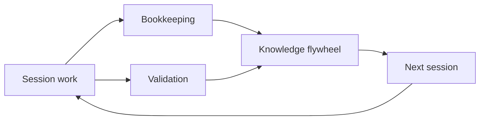

<div align="center">

# AgentOps

[](https://github.com/boshu2/agentops/actions/workflows/validate.yml)
[](https://github.com/boshu2/agentops/actions/workflows/nightly.yml)
[](https://github.com/boshu2/agentops/stargazers)

### Coding agents don't do their own bookkeeping.

AgentOps is the operational layer for coding agents. It adds bookkeeping, validation, primitives, and flows so every session starts where the last one left off.

[Install](#install) · [Quick Start](#quick-start) · [Skills](#skills) · [CLI](#the-ao-cli) · [Doctrine](https://12factoragentops.com) · [Docs](docs/INDEX.md)

</div>

---

## What AgentOps Gives You

AgentOps gives your coding agent four things it does not have by default:

| Layer | What changes |
|-------|--------------|
| **Bookkeeping** | Learnings, findings, handoffs, and reusable context land in local `.agents/` files |
| **Validation** | `/pre-mortem`, `/vibe`, and `/council` challenge plans and code before they ship |
| **Primitives** | Skills, hooks, and the `ao` CLI give agents reusable building blocks |
| **Flows** | `/research`, `/implement`, `/validation`, and `/rpi` compose those primitives end to end |

Session 1, your agent spends two hours debugging a timeout bug. Session 15, a new agent finds the lesson in seconds because the repo kept it.

Under the hood, AgentOps acts as a context compiler: raw session signal becomes reusable knowledge, compiled prevention, and better next work.



Local and auditable: `.agents/` is plain text you can grep, diff, review, and commit when you choose. There is no telemetry or cloud service requirement.

---

## Install

Pick the runtime you use.

**Claude Code**

```bash
claude plugin marketplace add boshu2/agentops
claude plugin install agentops@agentops-marketplace
```

**Codex CLI on macOS, Linux, or WSL**

```bash
curl -fsSL https://raw.githubusercontent.com/boshu2/agentops/main/scripts/install-codex.sh | bash
```

**Codex CLI on Windows PowerShell**

```powershell
irm https://raw.githubusercontent.com/boshu2/agentops/main/scripts/install-codex.ps1 | iex
```

**OpenCode**

```bash
curl -fsSL https://raw.githubusercontent.com/boshu2/agentops/main/scripts/install-opencode.sh | bash
```

**Other skills-compatible agents**

```bash
npx skills@latest add boshu2/agentops --cursor -g
```

Restart your agent after install. Then type `/quickstart` in your agent chat.

The `ao` CLI is optional, but recommended. It unlocks repo-native bookkeeping, retrieval, health checks, and terminal workflows.

**macOS**

```bash
brew tap boshu2/agentops https://github.com/boshu2/homebrew-agentops
brew install agentops
ao version
```

**Windows PowerShell**

```powershell
irm https://raw.githubusercontent.com/boshu2/agentops/main/scripts/install-ao.ps1 | iex
ao version
```

You can also install the CLI from [release binaries](https://github.com/boshu2/agentops/releases) or [build from source](cli/README.md).

| Concern | Answer |
|---------|--------|
| What it touches | Installs skills globally and registers runtime hooks when requested; agent work writes local bookkeeping to `.agents/` |
| Source code changes | None during install |
| Network behavior | Install and update paths fetch from GitHub; repo artifacts stay local unless you choose external tools or remote model runtimes |
| Telemetry | None required |
| Permission surface | Skills can run shell commands and read or write repo files during agent work, so install where you want agents to operate |
| Reversible | Remove the installed skill directories, delete `.agents/`, and remove hook entries from your runtime settings |

Troubleshooting: [docs/troubleshooting.md](docs/troubleshooting.md) · Configuration: [docs/ENV-VARS.md](docs/ENV-VARS.md)

---

## Quick Start

Inside a repo, run one command in your agent chat:

```text
/quickstart
```

That detects setup, explains the system, and gives you the next action.

Then try the smallest useful flow:

```text
/council validate this PR
```

Or let AgentOps run the full discovery-to-validation loop:

```text
/rpi "a small goal"
```

If you installed the CLI, check your local setup:

```bash
ao doctor
ao demo
```

New project? Use the guided CLI path:

```bash
ao quick-start
```

Full catalog: [docs/SKILLS.md](docs/SKILLS.md) · Unsure what to run? [Skill Router](docs/SKILL-ROUTER.md)

---

## See It Work

**One command: validate a PR**

```text
> /council validate this PR

[council] 3 judges spawned independently
[judge-1] PASS - token bucket implementation correct
[judge-2] WARN - rate limiting missing on /login endpoint
[judge-3] PASS - Redis integration follows middleware pattern
Consensus: WARN - add rate limiting to /login before shipping
```

**Full loop: research through post-mortem**

```text
> /rpi "add retry backoff to rate limiter"

[research]    Found 3 prior learnings on rate limiting
[plan]        2 issues, 1 wave
[pre-mortem]  Council validates the plan
[crank]       Executes the scoped work
[vibe]        Council validates the code
[post-mortem] Captures new learnings in .agents/
[flywheel]    Next session starts with better context
```

The point is not a bigger prompt. The point is a repo that remembers what worked.

---

## Skills

Every skill works alone. Flows compose them when you want more structure.

| Skill | Use it when |
|-------|-------------|
| `/quickstart` | You want the fastest setup check and next action |
| `/council` | You want independent judges to review a plan, PR, or decision |
| `/research` | You need codebase context and prior learnings before changing code |
| `/pre-mortem` | You want to pressure-test a plan before implementation |
| `/implement` | You want one scoped task built and validated |
| `/rpi` | You want discovery, build, validation, and bookkeeping in one flow |
| `/vibe` | You want a code-quality and risk review before shipping |
| `/evolve` | You want a goal-driven improvement loop with regression gates |
| `/dream` | You want overnight knowledge compounding that never mutates source code |

<details>
<summary><b>Full catalog</b> - validation, flows, bookkeeping, and session skills</summary>

**Validation:** `/council` · `/vibe` · `/pre-mortem` · `/post-mortem`

**Flows:** `/research` · `/plan` · `/implement` · `/crank` · `/swarm` · `/rpi` · `/evolve`

**Bookkeeping:** `/retro` · `/forge` · `/flywheel` · `/compile`

**Session:** `/handoff` · `/recover` · `/status` · `/trace` · `/provenance` · `/dream`

**Product:** `/product` · `/goals` · `/release` · `/readme` · `/doc`

**Utility:** `/brainstorm` · `/bug-hunt` · `/complexity` · `/scaffold` · `/push`

Full reference: [docs/SKILLS.md](docs/SKILLS.md)

</details>

<details>
<summary><b>Cross-runtime orchestration</b> - mix Claude, Codex, Cursor, and OpenCode</summary>

AgentOps keeps the workflow shape consistent across runtimes. Use the same validation, research, delivery, and bookkeeping flows whether the active worker is Claude Code, Codex, Cursor, or OpenCode.

That lets one runtime lead a session, another review the result, and a third handle focused implementation. The exact adapter is runtime-specific; the product contract is the same: independent context, auditable files, and explicit validation before promotion.

</details>

---

## The `ao` CLI

The `ao` CLI is the repo-native control plane behind the skills. It handles retrieval, health checks, compounding, goals, and terminal workflows.

```bash
ao quick-start                            # Set up AgentOps in a repo
ao doctor                                 # Check local health
ao demo                                   # See the value path in 5 minutes
ao search "query"                         # Search session history and local knowledge
ao lookup --query "topic"                 # Retrieve curated learnings and findings
ao context assemble                       # Build a task briefing
ao rpi phased "fix auth startup"          # Run the phased lifecycle from the terminal
ao evolve --max-cycles 1                  # Run one autonomous improvement cycle
ao overnight setup                        # Prepare private Dream runs
ao metrics health                         # Show flywheel health
```

Full reference: [CLI Commands](cli/docs/COMMANDS.md)

---

## Advanced: Day Loop And Night Loop

Use `/evolve` when you want code improvement. It reads `GOALS.md`, fixes the worst fitness gap, runs regression gates, and records the cycle.

```text
> /evolve

[evolve] GOALS.md loaded
[cycle-1] Worst gap selected
[rpi]     Implements the fix
[gate]    Tests and quality checks pass
[learn]   Post-mortem feeds the flywheel
```

Use `/dream` when you want knowledge compounding. It runs offline-style bookkeeping work over `.agents/`, reports what changed, and never mutates source code, invokes `/rpi`, or performs git operations.

```text
> /dream start

[overnight] INGEST  harvest new artifacts
[overnight] REDUCE  dedup, defrag, close loops
[overnight] MEASURE corpus quality
[halted]    plateau reached

Morning report: .agents/overnight/<run-id>/summary.md
```

Run Dream overnight, then run Evolve in the morning against a fresher corpus. The model may be the same; the environment is smarter.

---

## How AgentOps Fits With Other Tools

| Tool | What it does well | What AgentOps adds |
|------|-------------------|--------------------|
| **[GSD](https://github.com/glittercowboy/get-shit-done)** | Clean subagent spawning, fights context rot | Cross-session bookkeeping and validation gates |
| **[Compound Engineer](https://github.com/EveryInc/compound-engineering-plugin)** | Knowledge compounding, structured loop | Multi-runtime skills, council validation, and repo-native `ao` workflows |

[Detailed comparisons](docs/comparisons/)

---

## Docs

| Topic | Where |
|-------|-------|
| Published site | [boshu2.github.io/agentops](https://boshu2.github.io/agentops/) |
| Start navigating | [Docs index](docs/INDEX.md) |
| New contributor orientation | [Newcomer guide](docs/newcomer-guide.md) |
| Full skill catalog | [Skills](docs/SKILLS.md) |
| CLI reference | [CLI commands](cli/docs/COMMANDS.md) |
| Architecture | [Architecture](docs/ARCHITECTURE.md) |
| Behavioral discipline | [Behavior guide](docs/behavioral-discipline.md) |
| FAQ | [FAQ](docs/FAQ.md) |

**Building docs locally.** The site is built with [MkDocs Material](https://squidfunk.github.io/mkdocs-material/). Python 3.10+ is required; the dev toolchain is pinned in `requirements-docs.txt`.

```bash
scripts/docs-build.sh --serve    # live-reload dev server at http://127.0.0.1:8000
scripts/docs-build.sh --check    # strict build (mirrors what CI runs)
scripts/docs-build.sh            # build site to _site/
```

The first run creates `.venv-docs/` and installs the toolchain via `uv` (preferred) or `pip`. The deploy workflow at `.github/workflows/docs.yml` runs the same `mkdocs build --strict` on every push to `main` and publishes to GitHub Pages.

---

## The 12-Factor Doctrine

AgentOps is shaped by a set of public principles — the 12 factors of agent operations. Foundation, Flow, Knowledge, and Scale. Read them at **[12factoragentops.com](https://12factoragentops.com)**.

| Tier | Factors |
|------|---------|
| **Foundation (I-III)** | Context Is Everything · Track Everything in Git · One Agent, One Job |
| **Flow (IV-VI)** | Research Before You Build · Validate Externally · Lock Progress Forward |
| **Knowledge (VII-IX)** | Extract Learnings · Compound Knowledge · Measure What Matters |
| **Scale (X-XII)** | Isolate Workers · Supervise Hierarchically · Harvest Failures as Wisdom |

The AgentOps product implements these principles through skills, the `ao` CLI, and local bookkeeping in `.agents/`. See each factor page at [12factoragentops.com/factors](https://12factoragentops.com/factors) for the doctrine behind the mechanism.

---

## Contributing

See [docs/CONTRIBUTING.md](docs/CONTRIBUTING.md). Agent contributors should also read [AGENTS.md](AGENTS.md) and use `bd` for issue tracking.

## License

Apache-2.0 · [Docs](docs/INDEX.md) · [CLI Reference](cli/docs/COMMANDS.md)
