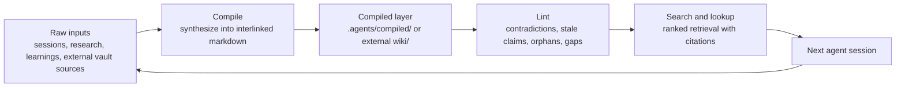

# Compiled Knowledge Workspace

## Problem Frame

Karpathy's LLM Wiki pattern is a strong fit for AgentOps because it names the same product problem AgentOps already solves: agents should not re-derive useful context from raw material every session. The useful product move is not to clone a second-brain app. AgentOps already has a repo-native bookkeeping flywheel, `/compile`, `ao search`, `ao lookup`, `ao curate`, `ao mind`, and `ao overnight`. The gap is that the compiled wiki layer is still mostly skill-led instead of a first-class CLI and lifecycle surface.

The feature should graduate the existing `/compile` concept into a CLI-backed compiled knowledge workspace: raw `.agents/` artifacts and optional external vault material are compiled into an interlinked markdown layer, linted for health, and fed back into search, lookup, context assembly, and Dream without replacing the current promotion gates.

## Existing AgentOps Context

- AgentOps already frames the product as a context compiler where raw session signal becomes reusable knowledge, compiled prevention, and better next work in `README.md`, `PRODUCT.md`, and `docs/knowledge-flywheel.md`.
- `/compile` already reads `.agents/` artifacts and targets `.agents/compiled/` with `index.md`, `log.md`, backlinks, hashes, and a lint report in `skills/compile/SKILL.md` and `skills-codex/compile/SKILL.md`.
- `skills/llm-wiki/SKILL.md` exists as an unmerged proposal for the external-knowledge half of the pattern: `raw/` to `wiki/`, with ingest/query/lint/promote operations and a clear statement that it complements rather than replaces `skills/compile`.
- The Codex `/compile` skill explicitly says the CLI does not yet expose a dedicated compile subcommand and points unattended runs to host schedulers or `ao overnight start`.
- `ao search` already brokers CASS, repo-local `.agents/` artifacts, and optional Obsidian Smart Connections.
- `ao mind` already wraps a graph-normalization tool for `.agents/` markdown, but it is a graph helper, not the compiled knowledge lifecycle.
- `ao overnight` is already the private scheduled knowledge-compounding loop. It is the natural home for unattended compilation and linting.

## Requirements

**Core Product Surface**

- R1. AgentOps must treat compiled knowledge as an extension of the existing flywheel, not as a replacement for `.agents/learnings/`, `.agents/patterns/`, `.agents/findings/`, or the pool promotion gates.
- R2. AgentOps must expose a first-class CLI surface for the existing compile workflow so operators do not need to know skill-internal script paths.
- R3. The CLI surface must support at least these modes: full compile, compile-only, lint-only, defrag-only, incremental, and force.
- R4. The default source root must be `.agents/`, and the default output root must be `.agents/compiled/`.
- R5. Compiled articles must carry source provenance back to the raw artifacts they synthesize.
- R6. The compiled layer must maintain both a content catalog and a chronological operation log.

**Retrieval and Lifecycle Integration**

- R7. `ao search` and retrieval-oriented flows must be able to include compiled knowledge results without hiding whether a result came from raw session history, promoted learnings, findings, or compiled synthesis.
- R8. `ao lookup` or context assembly must be able to retrieve compiled synthesis when it is the best task-level context, while still preferring verified learnings and findings for rule-like guidance.
- R9. `ao overnight start` must have a path to run compile/lint as an optional knowledge-maintenance lane inside the existing no-source-mutation Dream boundary.
- R10. Lint output must be machine-readable enough for Dream reports, CI gates, or future `bd` follow-up creation, while still producing a human-readable markdown report.

**Health and Safety**

- R11. The lint pass must flag contradictions, stale code references, orphan pages, missing cross-references, and source artifacts that did not contribute to any compiled article.
- R12. The compiled layer must never silently overwrite raw source material.
- R13. External vault support must keep personal knowledge and repo-local work artifacts separate by default, with explicit source and output roots.
- R14. The system must distinguish synthesized claims from mechanically verified facts, because a persistent wiki can compound errors if provenance and invalidation are weak.

**External Vault Compatibility**

- R15. AgentOps should support the Karpathy three-layer layout as an optional mode: raw source root, wiki output root, and schema document.
- R16. Optional vault mode should allow `raw/` and `wiki/` layouts without forcing existing human-authored vault directories into AgentOps' internal `.agents/` taxonomy.
- R17. Always-load identity files like `SOUL.md` and `CRITICAL_FACTS.md` should remain out of the initial CLI scope unless there is a clear AgentOps runtime use case; they are personal vault context, not core repo flywheel infrastructure.
- R18. If `skills/llm-wiki/` is retained, it must stay scoped to external knowledge and go through proposal review before merge.

## Success Criteria

- An operator can run one `ao` command to compile and lint `.agents/` knowledge into an interlinked markdown layer.
- Dream can include compile/lint health in its morning report without mutating source code or requiring host-specific scheduler setup.
- Search and lookup can surface compiled synthesis with provenance and clear result typing.
- Existing knowledge promotion behavior remains intact: verified learnings, patterns, findings, planning rules, and pre-mortem checks continue to work as they do today.
- A user with an Obsidian-style vault can opt into raw/wiki/schema paths without AgentOps moving or rewriting existing authored vault content.

## Scope Boundaries

- Do not build a full personal second-brain product as the first milestone.
- Do not make vector search or a database mandatory. Karpathy's own pattern allows index-first operation at moderate scale, and AgentOps already has search backends.
- Do not auto-promote compiled synthesis into durable rules without human or existing promotion-gate evidence.
- Do not couple the feature to a single model provider. Existing `AGENTOPS_COMPILE_RUNTIME` runtime selection should remain the baseline.
- Do not require Gemma, Ollama, or a GPU to use the CLI surface. Local Gemma is a strong scheduled-curator option, not a prerequisite.

## Key Decisions

- Extend existing `/compile` instead of creating a separate second-brain feature: the skill already contains the Karpathy-aligned behavior and output contract.
- Treat `skills/llm-wiki/` as a candidate external-vault skill, not the primary CLI foundation: it is useful product exploration, but the first CLI milestone should graduate the existing internal compiler because that is already wired to AgentOps' core flywheel.
- Put the CLI entry point in the knowledge command group: this matches `ao search`, `ao lookup`, `ao curate`, `ao mind`, `ao store`, and `ao temper`.
- Use `ao overnight` for scheduled maintenance: it already represents the no-source-mutation night loop and avoids inventing a parallel scheduler.
- Keep `.agents/compiled/` as the repo-local default: AgentOps' core product is repo-native agent work, while raw/wiki vault mode should be explicit.

## Alternatives Considered

- Build a new `ao wiki` command: clearer Karpathy branding and closer to the unmerged `skills/llm-wiki/` proposal, but it duplicates `/compile` if used for internal `.agents/` knowledge and risks splitting the knowledge model.
- Expand `ao mind`: useful for graph normalization, but the compiled wiki lifecycle includes LLM synthesis, hashing, linting, and lifecycle reporting, which is broader than graph operations.
- Make Obsidian vaults the primary model: attractive for personal knowledge, but it would shift AgentOps away from repo-native agent work and make existing `.agents/` concepts feel secondary.

## Dependencies / Assumptions

- `skills/compile/scripts/compile.sh` remains the canonical headless implementation unless planning finds it too brittle for CLI wrapping.
- `skills/llm-wiki/SKILL.md` is treated as unmerged user/proposal work unless explicitly accepted into scope.
- `ao overnight` can add an optional compile/lint step without violating Dream anti-goals.
- CLI docs must be regenerated if a command or flags are added.
- Codex artifacts and overrides must be updated if the compile skill behavior or CLI references change.

## External Research Notes

- Karpathy's gist describes the core difference from RAG as compiling knowledge once into a persistent wiki and keeping it current, with raw sources, wiki, and schema layers plus ingest, query, and lint operations.
- Karpathy's gist also calls out `index.md` and `log.md` as the navigation and chronology files, and notes that local markdown search can be optional at small-to-moderate scale.
- `NicholasSpisak/second-brain` is useful mainly as a simple raw/wiki/output/CLAUDE.md reference layout.
- `eugeniughelbur/obsidian-second-brain` shows the richer product frontier: save/ingest/reconcile/synthesize commands, scheduled daily/nightly/weekly/health agents, role presets, and always-load personal context files.
- Gist discussion surfaced the main risk AgentOps should emphasize: persistent knowledge turns one wrong link or claim into a prior future work may build on, so provenance, contradiction handling, and invalidation are product-critical.

Sources:
- https://gist.github.com/karpathy/442a6bf555914893e9891c11519de94f
- https://github.com/NicholasSpisak/second-brain
- https://github.com/eugeniughelbur/obsidian-second-brain

## Outstanding Questions

### Resolve Before Planning

- None.

### Deferred to Planning

- Affects R2, Technical: Should the CLI wrapper call `skills/compile/scripts/compile.sh`, move compile logic into Go, or start as a thin wrapper and migrate later?
- Affects R7, Technical: Should compiled articles become a new search result type or be folded into `knowledge` with source metadata?
- Affects R9, Technical: Should Dream run compile by default, behind a config flag, or only when the compiled corpus already exists?
- Affects R15, Technical: What should the exact external vault flags be: `--sources`, `--output`, `--schema`, `--vault`, or a named profile in AgentOps config?
- Affects R18, Technical: Should `skills/llm-wiki/` merge as a separate experimental skill, fold into `/compile`, or remain out-of-tree until the CLI surface lands?

## Next Steps

-> `/ce:plan` for structured implementation planning.
